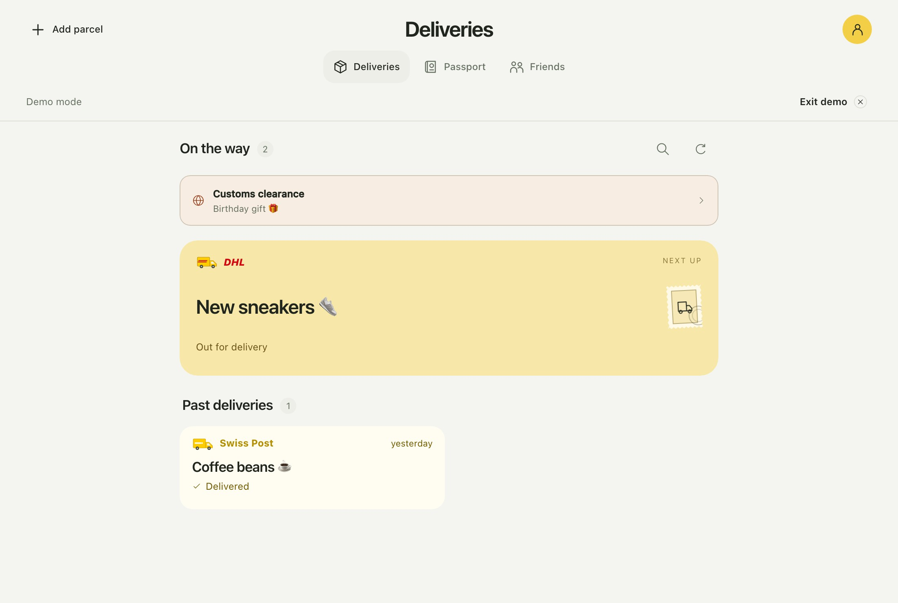
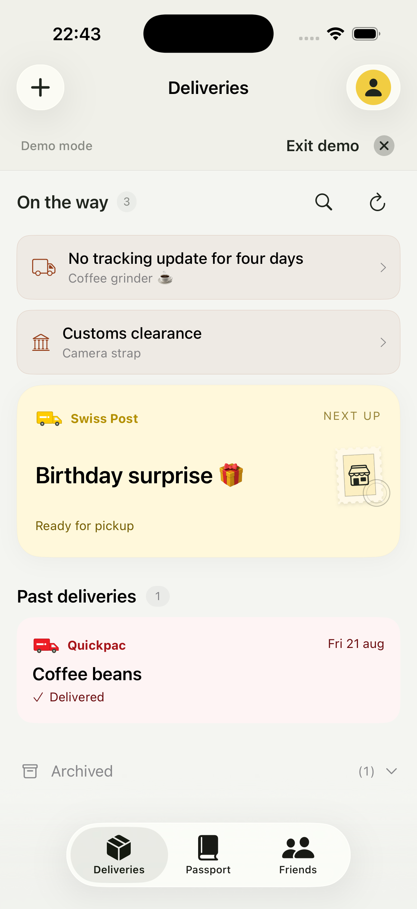
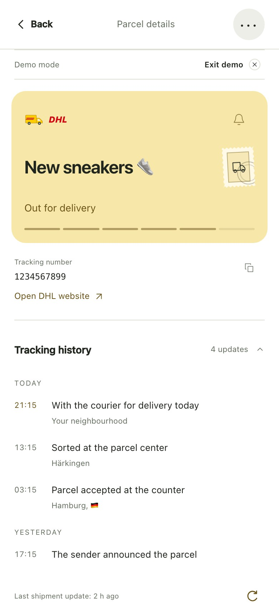
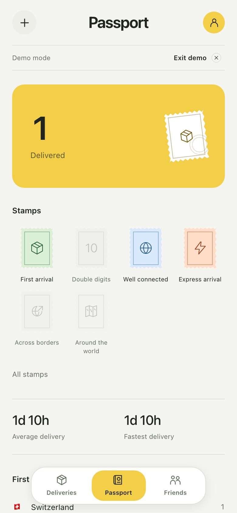

<p align="center">
  
</p>

<h1 align="center">Delivery Tracker</h1>

<p align="center">Open-source parcel tracking for iPhone and the web.</p>

<p align="center">
  <a href="https://github.com/plhery/delivery-tracker/actions/workflows/ci.yml"></a>
  <a href="LICENSE"></a>
</p>

<p align="center">
  <a href="https://delivery.plhery.com">Open app</a> ·
  <a href="#local-development">Run locally</a> ·
  <a href="#iphone">iPhone</a> ·
  <a href="#self-hosting">Self-hosting</a>
</p>

<p align="center">
  
</p>

## Features

- Delivery estimates, tracking timelines, search, filters, and an archive.
- Add parcels from tracking numbers, carrier links, or shipping email text.
- Optional notifications with quiet hours and per-parcel mute.
- Passport stamps and statistics from delivery history. Share selected stats
  with friends by invitation; parcel details stay private.
- Synced accounts, light and dark themes, and English, German, French, Italian, Spanish, Portuguese, and Polish.
- Installable web app and native iPhone app with barcode scanning, a Share
  extension, offline snapshots, widgets, and Live Activities.

<p align="center">
  
  
  
</p>

<p align="center"><sub>iPhone · Tracking timeline · Passport. Screenshots use fictional parcels.</sub></p>

## Local development

Requires Node.js 24 and npm 10+. The local demo needs no account, database,
or environment file.

```bash
git clone https://github.com/plhery/delivery-tracker.git
cd delivery-tracker
nvm use
npm ci
npm run dev
```

Open [localhost:3000](http://localhost:3000) and select **Explore the demo**.
Refresh advances the sample parcels; **Reset demo data** in settings restores them.

For real accounts, copy [`.env.example`](.env.example) to `.env.local`, configure
Supabase, and set `NEXT_PUBLIC_USE_API=true`. See [Authentication](docs/AUTHENTICATION.md).

## Carriers

Supports Swiss Post, Planzer, Quickpac, DPD, GLS, DHL / Deutsche Post, UPS,
La Poste / Colissimo, Chronopost, Mondial Relay, Amazon Shipping France,
India Post, and other regional carriers.

In-transit parcels refresh every 2 minutes from 08:00–22:00 in `Europe/Zurich`;
PostNL and other stages refresh every 10 minutes. Checks run hourly overnight,
and GLS retains its longer carrier cooldowns. Unknown carriers can use 17TRACK and
ParcelsApp through a private TRAWL service. Asendia and FedEx are link-only;
ShipUp is a manual record.

Some integrations require a delivery postcode or complete tracking URL.
Carrier sites can change or block requests. See [carrier support](docs/CARRIERS.md)
for requirements and limitations.

## iPhone

Requires iOS 18+ and Xcode 26. Open
[`ios/SwissDeliveryTracker.xcodeproj`](ios/SwissDeliveryTracker.xcodeproj), select
the `SwissDeliveryTracker` scheme and an iPhone simulator, then run the demo.

See [native setup](ios/README.md) for server configuration, signing, and push
notifications.

## Self-hosting

Requires Supabase Auth, Postgres, Docker, and HTTPS. The server must run
continuously for background tracking.

1. Apply `supabase/migrations/*.sql` in filename order. For upgrades, check the
   [rollout notes](docs/DEPLOYMENT.md) first.
2. [Configure authentication](docs/AUTHENTICATION.md). The example below uses
   email OTP with custom SMTP.
3. Copy [`.env.example`](.env.example) to `.env`, set the Supabase values and
   `NEXT_PUBLIC_USE_API=true`, and remove unused optional service placeholders.
4. Build and run:

```bash
docker build \
  --build-arg NEXT_PUBLIC_SUPABASE_URL=https://supabase.example.com \
  --build-arg NEXT_PUBLIC_SUPABASE_PUBLISHABLE_KEY=your-public-key \
  --build-arg NEXT_PUBLIC_AUTH_EMAIL_OTP_ENABLED=true \
  -t delivery-tracker .

docker run -d --name delivery-tracker --restart unless-stopped \
  --env-file .env -p 3000:3000 delivery-tracker
```

Serve port `3000` behind HTTPS. `/health` reports readiness. Public Supabase
values are set at build time and must match the runtime configuration.
Service-role and private push keys stay on the server.

See [Deployment](docs/DEPLOYMENT.md) for backups, migrations, and production checks.

## Code and tests

Next.js, React, and TypeScript for the web and API; SwiftUI for iPhone.
Supabase Auth and Postgres row-level security isolate accounts. A database queue
handles carrier sync and notification delivery.

| Command | Purpose |
| --- | --- |
| `npm run lint` | Lint |
| `npm run typecheck` | TypeScript checks |
| `npm test` | Unit and integration tests |
| `npm run test:e2e` | Playwright browser tests |
| `npm run test:contract` | Generated API contract checks |
| `npm run build` / `npm start` | Production build and server |

See [Contributing](CONTRIBUTING.md) for the full validation workflow.

## Documentation

[Architecture](docs/ARCHITECTURE.md) · [Friends](docs/FRIENDS.md) ·
[Observability](docs/OBSERVABILITY.md) · [Analytics](docs/ANALYTICS.md) ·
[Privacy](PRIVACY.md) · [Security](SECURITY.md)

Licensed under [Apache 2.0](LICENSE).
