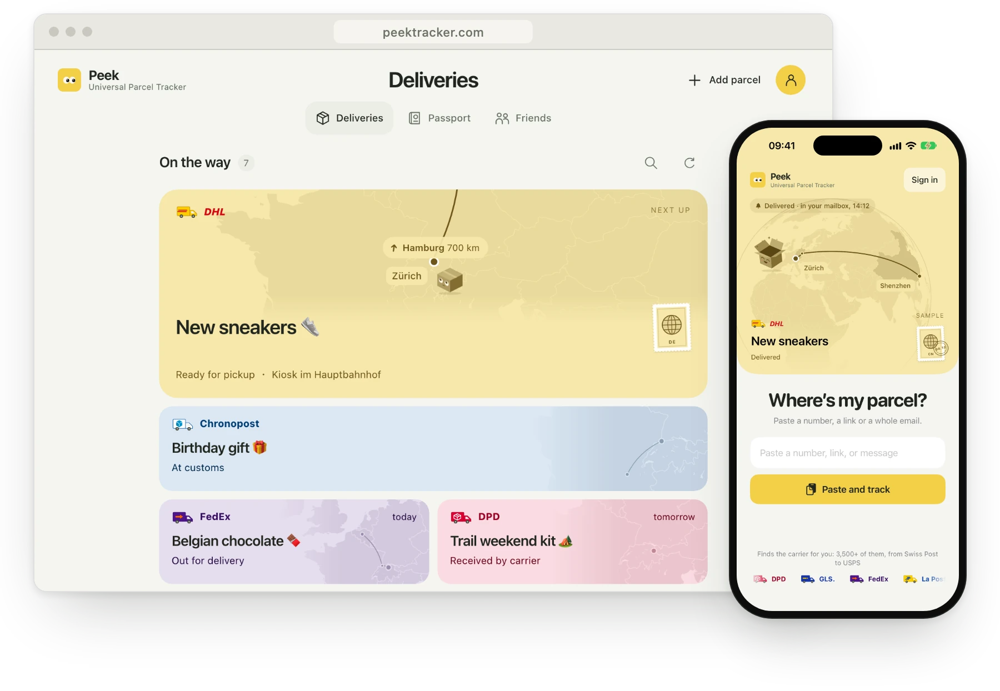
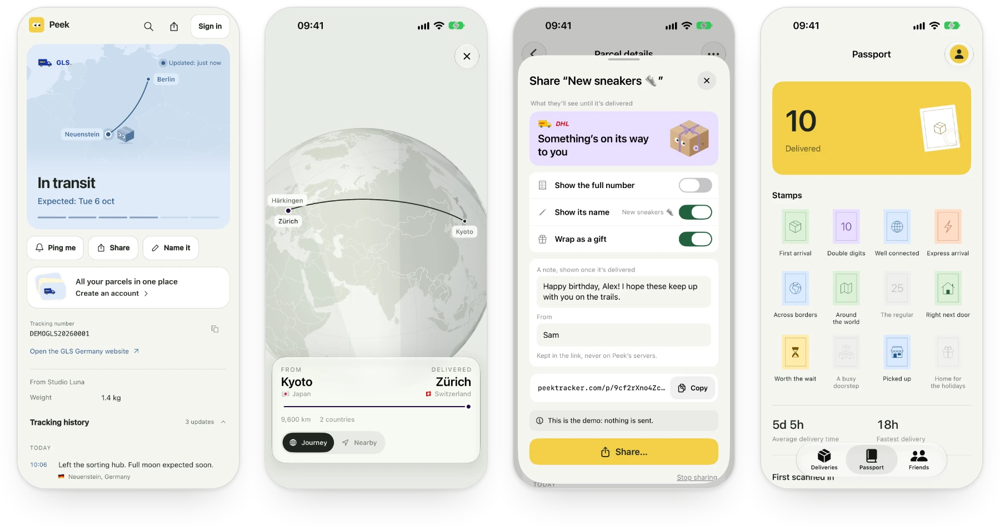

<div align="center">


# Peek

**Universal parcel tracker for iPhone and the web. Open source.**

Paste a tracking number, a carrier link or a whole shipping email.<br>
Peek finds the carrier, draws the journey, notifies you when the parcel moves.

<sub>The carriers are read by our engine, <a href="https://github.com/plhery/universal-parcel-scraper">Universal Parcel Scraper</a>.</sub>

[](https://github.com/plhery/peek-delivery-tracker/actions/workflows/ci.yml)
[](LICENSE)

[Try it: peektracker.com](https://peektracker.com) · [Run it locally](#run-it-locally) · [iPhone app](#iphone-app) · [Host your own](#host-your-own)

<picture>
  <source media="(prefers-color-scheme: dark)" srcset="docs/assets/hero-dark.webp">
  
</picture>

</div>

## What you get

**Where's my parcel?**<br>
Paste what you have. Peek works out which of 3,500+ carriers has the parcel and gives it a
page of its own: the journey on a map, every scan, the day it should arrive. No account
needed.

**Will I know when it moves?**<br>
Yes. Choose every scan, the important steps or delivery day only, on your iPhone or in
your browser. Quiet hours keep the night quiet, and an email can tell you it arrived.

**Following more than one?**<br>
Sign in and they share one list, on the web and on the iPhone. Each delivery stamps your
passport, which you can compare with friends while your parcels stay private.

**Someone else waiting for it?**<br>
Share the parcel's page with them. Wrap it as a gift, and what's inside stays a surprise
until it arrives.

<p align="center">
  <picture>
    <source media="(prefers-color-scheme: dark)" srcset="docs/assets/screens-dark.webp">
    
  </picture>
</p>

<p align="center"><sub>A parcel's page · its journey · shared as a gift · the passport. Every parcel in these pictures is made up.</sub></p>

Also in the box: light and dark themes, seven languages (English, German, French, Italian,
Spanish, Portuguese and Polish), a web app you can install, and on iPhone a barcode
scanner, a Share extension and widgets.

Peek shows no ads and sells no data. A parcel followed without an account is forgotten 30
days after it arrives. The [privacy notice](PRIVACY.md) has the rest.

Stuck? [Help](SUPPORT.md) says what to check and where to write.

## Carriers live next door

Reading carriers is a job of its own, so it has a repository of its own:
**[Universal Parcel Scraper](https://github.com/plhery/universal-parcel-scraper)**. It
works out which carrier a number belongs to, reads that carrier's own site, falls back on
universal trackers such as ParcelsApp, Ship24 and 17TRACK, and turns everyone's wording
into the same delivery stages.

Peek installs it from npm and builds the rest around it: accounts, checks in the
background, notifications and the two apps.

- A carrier is missing, or tracks wrongly?
  [Tell the scraper](https://github.com/plhery/universal-parcel-scraper/issues/new/choose).
- Want tracking without Peek? The scraper runs on its own, as a command-line tool, a Node
  library or a small HTTP server.
- Curious how the two fit together? See [the scraper package](docs/SCRAPER.md).

## Run it locally

You need Node.js 26. No account, no database, no `.env` file.

```bash
git clone https://github.com/plhery/peek-delivery-tracker.git
cd peek-delivery-tracker
nvm use
npm ci
npm run dev
```

Open [localhost:3000](http://localhost:3000) and paste anything: with no server behind it,
Peek answers in the browser with made-up parcels.

- Tap Pip, the parcel with a face, to open a sample parcel.
- [localhost:3000/demo](http://localhost:3000/demo) is a whole list of sample deliveries.
  Refresh moves them along, and **Reset demo data** in settings starts over.
- [localhost:3000/design/map](http://localhost:3000/design/map) is a study of three ways
  to draw a journey, from the globe to a close-up.

For real accounts and real tracking, copy [`.env.example`](.env.example) to `.env.local`,
fill in your Supabase project and set `NEXT_PUBLIC_USE_API=true`.
[Authentication](docs/AUTHENTICATION.md) has the steps.

## iPhone app

A native SwiftUI app for iOS 18 and later. It isn't on the App Store yet, so for now you
build it yourself: open [`ios/PeekDeliveryTracker.xcodeproj`](ios/PeekDeliveryTracker.xcodeproj)
in Xcode 27 or newer, pick the `PeekDeliveryTracker` scheme and an iPhone simulator, and
press Run. It starts with sample parcels, so it needs no account, no server and no Apple
team.

The [iPhone guide](ios/README.md) covers connecting it to a server, signing it for a real
phone, notifications and widgets.

## Host your own

Peek is one long-running container (the web app, the API and the worker that keeps
checking carriers) next to Supabase for sign-in and Postgres, behind HTTPS.
[Deployment](docs/DEPLOYMENT.md) takes you through the database, sign-in, the build,
upgrades and backups.

## Under the hood

Next.js, React and TypeScript for the web and the API, SwiftUI for the iPhone. Supabase
Auth and Postgres row-level security keep accounts apart, and a queue in the database runs
the carrier checks and the notifications.

- [Architecture](docs/ARCHITECTURE.md): how the pieces fit, and who can see what
- [Scraper package](docs/SCRAPER.md): what Peek takes from the scraper, and how it updates
- [Routing](docs/ROUTING.md): where a refresh looks for a parcel's history
- [Deployment](docs/DEPLOYMENT.md): hosting, upgrades, operations
- [Authentication](docs/AUTHENTICATION.md): Google, Apple and email sign-in
- [Observability](docs/OBSERVABILITY.md): logs, audit tables, Sentry, metrics
- [Friends](docs/FRIENDS.md): how passports are shared, and what never is
- [Analytics](docs/ANALYTICS.md): optional usage analytics with Umami
- [Localization](docs/LOCALIZATION.md): which language carrier text shows up in
- [iPhone](ios/README.md): the native app

## Contributing

Fixes and ideas are welcome. [Contributing](CONTRIBUTING.md) has the setup and the checks
to run before a pull request. Carrier fixes go to the
[scraper](https://github.com/plhery/universal-parcel-scraper/blob/main/CONTRIBUTING.md).
Found a security problem? [Report it privately](SECURITY.md).

Made by [@plhery](https://x.com/plhery). Licensed under [Apache 2.0](LICENSE).
